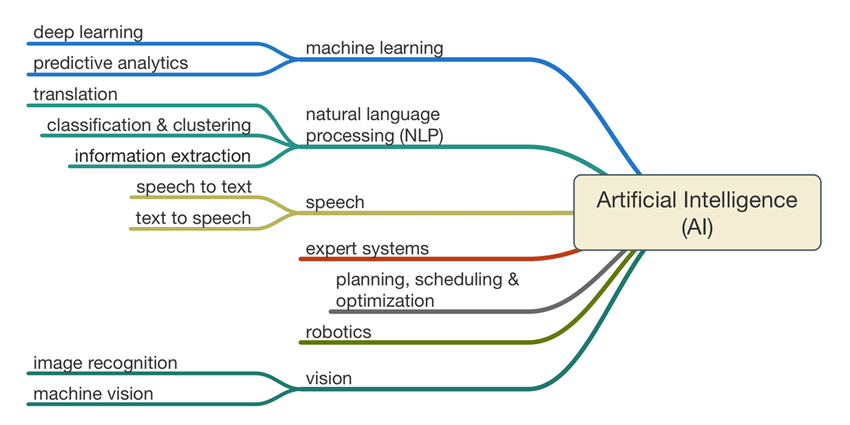

Table of contents
=================

<!--ts-->
   * [Overviw](https://github.com/Laudarisd/Deep-learning-and-ML-preparation/edit/main/ML/README.md)
   * [Test](https://github.com/Laudarisd/Deep-learning-and-ML-preparation/tree/main/src)
      * [Test](https://github.com/Laudarisd/Deep-learning-and-ML-preparation/tree/main/src/Machine_Learning_all)
<!--te-->

============================================================================================================

============================================================================================================

Overview
================================================

<table border="0">
   <tr>
      <td>
      
      </td>
   </tr>
   </table>
   
   
   
*More Details*

<table border="0">
   <tr>
      <td>
      
      </td>
   </tr>
   </table>

# Basic Needs #

1. Statistics
2. Linear Algebra
3. Calculus
4. Probability
5. Programming Languages

# Which Programming Language #

1. R
2. Python
3. Java

# Which Branch #

1. Supervised Learning
2. Unsupervised Learning
3. Reinforcement Learning

<table border="0">
   <tr>
      <td>
      
      </td>
   </tr>
   </table>

============================================================================================================
   
   
   
   

   
   
   
   
   
   

